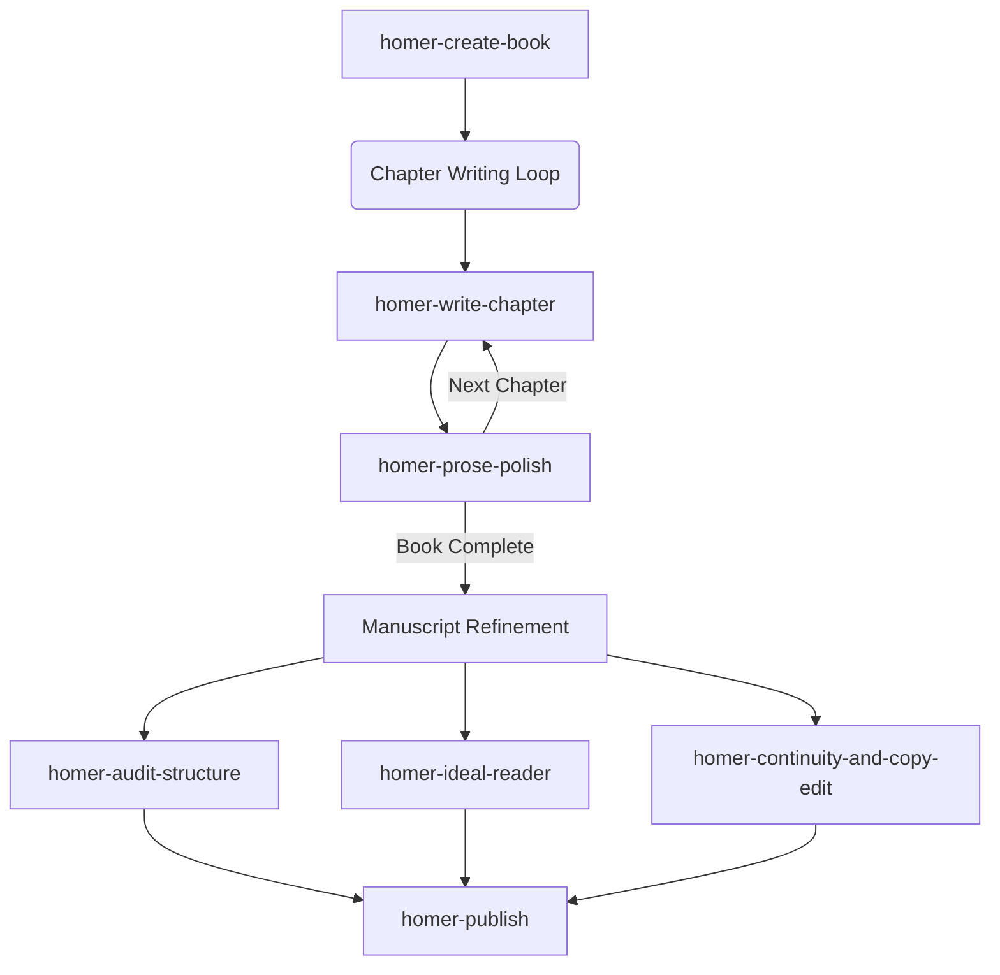

# Homer MCP (Collaborative Fiction Writing Server)

Homer MCP is a Model Context Protocol (MCP) server and agentic framework designed to enable collaborative fiction writing, structural editing, and publishing pipelines between humans and AI agents.

Originally developed as a private assistant, this repository serves as the public open-source release of the Homer MCP project.

---

## 📖 Overview

Homer MCP acts as a bridge between LLM writing agents and book project directories (supporting Scrivener `.scriv` and a home-brewn GitBook `.gitbook` format). It exposes a suite of 32 tools enabling writing models to directly navigate outline hierarchies, draft scenes, run analytical developmental critiques, simulate readers, and compile final drafts to Kindle-compliant ebooks.

**Note on cost:** The MCP uses OpenRouter, allowing you to choose which LLMs do the writing and editing. For the included example book (*Shadow Falls*), the writer was Claude 3.5 Sonnet and the editor was Gemini 2.0 Pro (or equivalent models). In total, the book cost about 12 USD to produce.

---

## 📂 Repository Layout

- **[mcp_server/](mcp_server/)**: The core python implementation of the Model Context Protocol server.
- **[skills/](skills/)**: Modular agentic writing skills representing multi-step authoring workflows (outlining, scene drafting, copy-editing, auditing).
- **[Shadow Falls.gitbook/](Shadow%20Falls.gitbook/)**: An example book project in the `.gitbook` format — a git-friendly, folder-based representation of a book project. It showcases how manuscript outlines, character bibles, location profiles, and story notes are structured for the MCP.
  - 📖 [Read the compiled manuscript](Shadow%20Falls.md)
  - 📱 [Download EPUB](Shadow%20Falls.epub)
- **[engine_deprecated/](engine_deprecated/)**: The original custom Python-based writing assistant, preserved here as historical context only.
- **[run.sh](run.sh)**: A bootstrapping script to start the server, the live background browser viewer, and launch `opencode` as the conversational agent to interface with the MCP.
- **[.env.example](.env.example)**: Environment template file.

---

## 🛠️ Model Context Protocol (MCP) Capabilities

Homer exposes 32 tools to agent clients, categorized into several core areas:
1. **Outline & Binder Navigation**: Seamless read/write integration for manuscript chapters, scenes, characters, and places.
2. **AI Co-Writing & Draft Generation**: Highly calibrated engines to compile prompts, draft scenes, and generate chapter beats.
3. **Readability Diagnostics**: Analyzes prose for reading level (Flesch-Kincaid Grade Level), sentence length, adverb density, passive voice, and filler words.
4. **Macro-Structural Auditing**: Runs developmental editing audits over the entire manuscript to catalog plot beats, timelines, character goals, and thematic developments.
5. **Ideal Reader Simulation**: Simulates specific persona-driven reader perspectives to identify potential pacing, continuity, or emotional resonance issues.
6. **Ebook Publishing**: Direct rendering to standard Kindle-compatible print PDF, Markdown, or EPUB (`"amazon"` format) with support for hierarchical tables of contents.
7. **Web UI & Live Viewer**: A background web server providing a browser-based split-view text editor with real-time AI styling.

---

## 📈 Writing Workflow & AI Skills

Homer orchestrates AI capabilities through modular **Agentic Skills** situated in the `skills/` directory. By combining the skills in a structured lifecycle loop, a writer or autonomous agent can take a book from a blank outline to a polished, shelf-ready manuscript.



### 1. Book Setup
* **`homer-create-book`**: The starting point. Generates the initial project folders, binder layout, and core outline from a genre concept and premise.

### 2. Chapter Writing Loop (Iterative Draft Generation)
Repeat this loop for each chapter of the manuscript:
* **`homer-write-chapter`**: Takes chapter outline beats and expands them into a full scene draft, taking into account continuity constraints.
* **`homer-prose-polish`**: Analyzes generated prose against genre benchmarks (sentence lengths, adverb densities, passive verbs) and uses AI to polish structural flaws.

### 3. Book Refinement & Audits (Whole-Manuscript Polish)
Once the main draft is complete, run comprehensive audits on the entire text:
* **`homer-audit-structure`**: Evaluates act structures, scene pacing, subplots, and narrative arcs.
* **`homer-ideal-reader`**: Simulates the target audience reading the manuscript to highlight emotional beats, reader fatigue, and questions.
* **`homer-continuity-and-copy-edit`**: Cross-references character details and setting elements to build a continuity bible, auditing the text for discrepancies.

### 4. Publication
* **`homer-publish`**: Generates KDP-compliant print PDFs, EPUB e-books, and markdown source files. Ready to go live on Kindle, Kobo, or print-on-demand platforms.

---

## 🚀 Getting Started

To run the Homer MCP server, connect it to your MCP client (such as Claude Desktop, OpenCode, or other IDE integrations).

### 1. Setup Local Environment

1. **Install Dependencies**:
   ```bash
   pip install -r requirements.txt
   ```
2. **Configure Environment Variables**:
   ```bash
   cp .env.example .env
   # Add your OPENROUTER_API_KEY
   ```

### 2. Launch conversational client and live viewer

Execute the bootstrapper script to spin up the background browser services and editor on port 8090, and launch the conversational agent interface:
```bash
./run.sh
```

> [!NOTE]
> The `run.sh` script uses `opencode` as the conversational agent to interface with the MCP. You can interact with it just like a writing assistant to guide the creation, auditing, polishing, and compilation of your manuscript.

### 3. MCP Configuration

Add the server to your client's `mcp_config.json`:

```json
{
  "mcpServers": {
    "homer": {
      "command": "python",
      "args": ["/path/to/shadow-falls/mcp_server/server.py"]
    }
  }
}
```

*For licensing information, see [LICENSE.md](LICENSE.md).*
